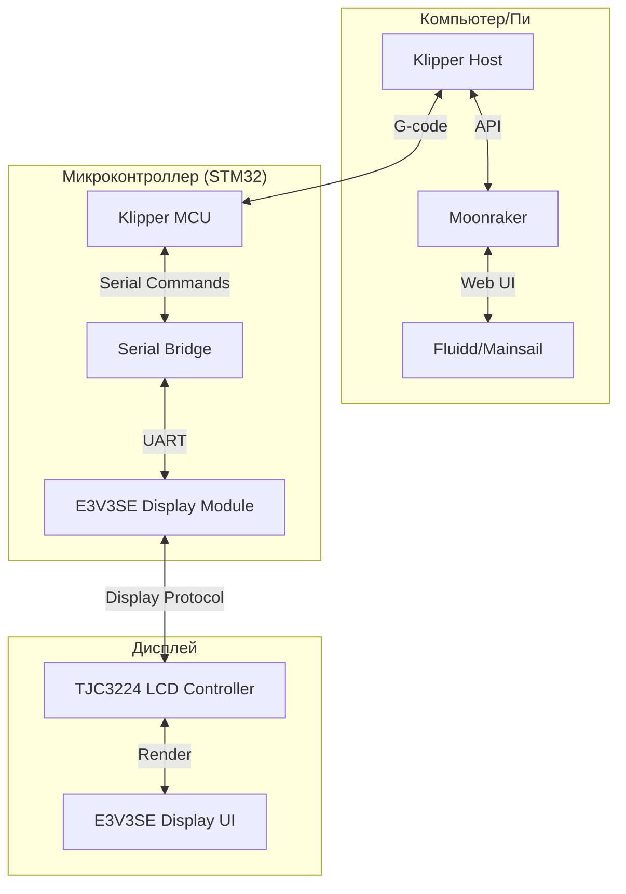

# Архитектурный план реализации Klipper с поддержкой дисплея Ender 3 V3 SE

## Обзор проекта

Проект представляет собой модифицированную версию Klipper, адаптированную для работы с оригинальным дисплеем Ender 3 V3 SE без необходимости в аппаратных изменениях. Основная цель - обеспечить возможность использования дисплея принтера через последовательный мост (serial bridge) между USB и портом дисплея.

## Компоненты системы

### 1. Serial Bridge (Мост передачи данных)

- **Файлы**: `src/serial_bridge.c`, `src/stm32/serial_bridge.c`, `klippy/extras/serial_bridge.py`
- **Функция**: Обеспечивает двунаправленную передачу данных между основной системой Klipper и дисплеем через UART интерфейс
- **Архитектура**: Реализован как промежуточный слой, преобразующий команды Klipper в протокол, понятный дисплею

### 2. Интерфейс дисплея

- **Файл**: `klippy/extras/e3v3se_display.py`
- **Функция**: Управляет взаимодействием с дисплеем, обрабатывает нажатия кнопок, отображает информацию
- **Особенности**: Поддерживает все основные функции дисплея - печать файлов, настройки температур, движение осей, калибровку и т.д.

### 3. Контроллер дисплея

- **Файл**: `klippy/extras/TJC3224.py`
- **Функция**: Отвечает за низкоуровневое управление LCD-дисплеем TJC3224
- **Возможности**: Вывод текста, графики, обработка команд отображения

## Архитектурная диаграмма



## Рекомендации по установке и настройке

### 1. Подготовка микроконтроллера

- Использовать `make menuconfig` для настройки:
  - Микроконтроллер: STMicroelectronics STM32
  - Модель процессора: STM32F103
  - Загрузчик: 28KiB bootloader
  - Интерфейс связи: Serial (на USART1 PA10/PA9)
  - Активировать "Enable extra low-level configuration options"
  - Активировать "Enable serial bridge" и "USART2"

### 2. Конфигурация дисплея

- Добавить в `printer.cfg`:

``` [e3v3se_display]
language: english
logging: False
```

### 3. Макросы для дисплея

- Можно добавить пользовательские макросы через секции `[e3v3se_display MACRO%I]`
- Поддерживаются до 5 иконок с различными функциями

## Возможности кастомизации

### 1. Языковая поддержка

- Поддерживаемые языки: chinese, english, german, russian, french, turkish, spanish, italian, portuguese, japanese, korean

### 2. Пользовательские макросы

- Настройка до 5 иконок в меню "Misc"
- Возможность запуска различных G-код команд
- Выбор иконок из библиотеки (1-25)

### 3. Настройка интерфейса

- Изменение языка интерфейса
- Включение/отключение логирования
- Настройка параметров предварительного нагрева

## Поддерживаемые функции дисплея

| Функция | Статус |    |--------|--------|
| Печать файлов                     | ✅ |
| Настройка печати                  | ✅ |
| Пауза/продолжение печати          | ✅ |
| Остановка печати                  | ✅ |
| Движение осей                     | ✅ |
| Парковка осей                     | ✅ |
| Установка Z-смещения              | ✅ |
| Отключение двигателей             | ✅ |
| Предварительный нагрев            | ✅ |
| Охлаждение                        | ✅ |
| Температура сопла                 | ✅ |
| Температура стола                 | ✅ |
| Настройка максимальной скорости   | ❌ |
| Настройка максимального ускорения | ❌ |
| Настройка шагов на мм             | ❌ |
| Ручной зонд                       | ✅ |
| Пользовательские макросы          | ✅ |

## Процесс разработки

### Этап 1: Подготовка окружения

- Установка Klipper, Moonraker и интерфейса (Fluidd или Mainsail)
- Настройка KIAUH для установки кастомной версии Klipper

### Этап 2: Компиляция прошивки

- Настройка конфигурации через `make menuconfig`
- Компиляция с активированным serial bridge
- Загрузка прошивки в микроконтроллер принтера

### Этап 3: Настройка конфигурации

- Создание основного файла `printer.cfg`
- Добавление секции `[e3v3se_display]`
- Настройка пользовательских макросов

### Этап 4: Тестирование

- Проверка работы всех функций дисплея
- Проверка корректности отображения информации
- Тестирование пользовательских макросов

## Особые требования

1. **Версия прошивки дисплея**: Проект основан на версии 1.0.6 прошивки дисплея E3V3SE. Изменение версии может потребовать переназначения адресов ресурсов в памяти дисплея.

2. **Последовательный мост**: Реализация основана на предложении E4ST2W3ST для возможности работы микроконтроллера как моста между USB и последовательным портом дисплея.

3. **Интеграция с интерфейсом**: Дисплей работает параллельно с веб-интерфейсами, не мешая их работе.

## Заключение

Этот проект предоставляет полную поддержку оригинального дисплея Ender 3 V3 SE в экосистеме Klipper без необходимости в аппаратных модификациях. Архитектура позволяет легко расширять функциональность и адаптировать систему под различные требования пользователя.

Для успешной реализации проекта необходимо строго следовать рекомендациям по установке и настройке, особенно при работе с прошивкой микроконтроллера и дисплея.
